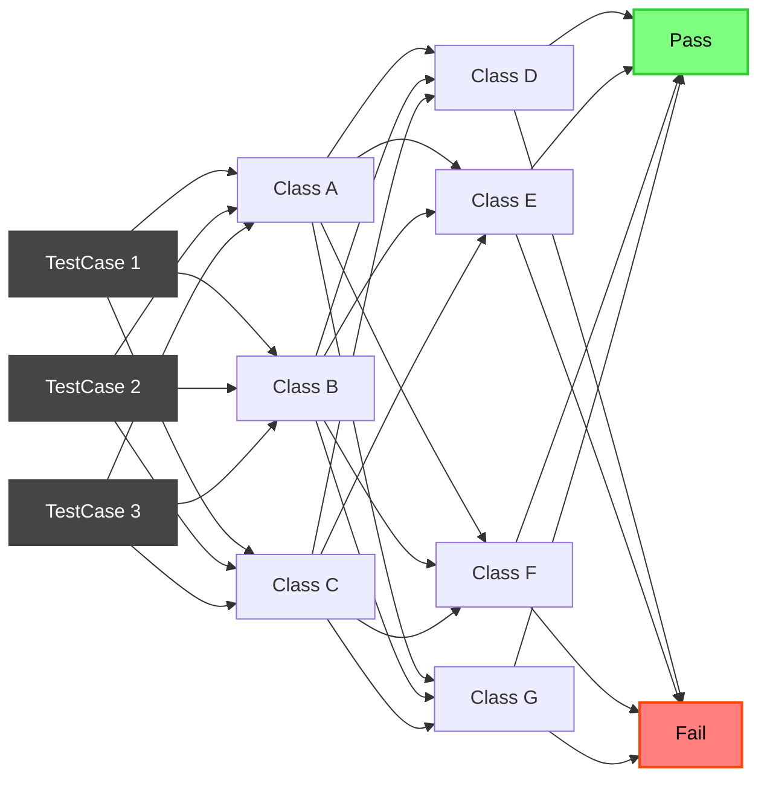

# Teste de integração

> [Para que serve?](/pages/p1.md)

> [Quando usar testes de integração e usar ou não 'mocks'?](/pages/p2.md)

> [Ferramentas](/pages/p3.md)

> [Implementação em um projeto real](/pages/p5.md)
